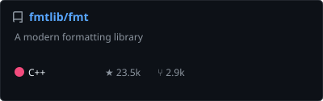
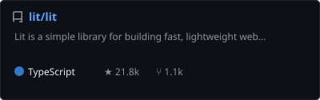
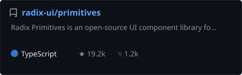
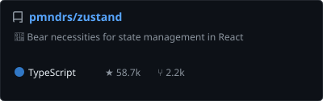

<!-- This file is generated, do not edit manually -->

<!--
**davbrito/davbrito** is a ✨ _special_ ✨ repository because its \`README.md\` (this file) appears on your GitHub profile.

Here are some ideas to get you started:

- 🔭 I’m currently working on ...
- 🌱 I’m currently learning ...
- 👯 I’m looking to collaborate on ...
- 🤔 I’m looking for help with ...
- 💬 Ask me about ...
- 📫 How to reach me: ...
- 😄 Pronouns: ...
- ⚡ Fun fact: ...
-->

## Hi there! I'm David, a full-stack developer. 👋

Welcome to my GitHub! I have 5 years of experience building full-stack applications with React , TypeScript , .NET/EF Core, and Node.js , along with Deno 🦕, Next.js , Vite  and PostCSS .

### Personal Projects

<dl><dt><a href="https://dolar.davbrito.dev/">Dolar</a></dt><dd>An app to check and track the dollar exchange rate. Built with TanStack Start.  </dd><dt><a href="https://github.com/davbrito/come-rico">ComeRico</a></dt><dd>A domestic/family app to plan meals and resolve culinary indecision via a real-time synchronized roulette. Built with ASP.NET Core, SignalR, and TanStack Start.    </dd><dt><a href="https://github.com/davbrito/atelier">Atelier</a></dt><dd>A sewing and tailoring quote generator. Manages materials, labor operations, and generates frozen quotes for clients. Built with TanStack Start, Cloudflare Workers, and PostgreSQL.    </dd><dt><a href="https://github.com/davbrito/iteretijs">IteretiJS</a></dt><dd>is a set of JavaScript iterator, generator, and web stream utilities. It's a lightweight library that provides a convenient way to work with streams and iterators in JavaScript, allowing you to write more efficient and maintainable code. It includes utilities such as map, filter, reduce, take, and skip, as well as utilities for working with web streams. </dd><dt><a href="https://github.com/davbrito/minurl">minurl</a></dt><dd>a simple URL shortener built for Cloudflare Pages and using Clodflare Workers KV. It allows you to create short URLs that redirect to long URLs, making it easy to share links on social media or in emails.   </dd><dt><a href="https://github.com/davbrito/dbds">dbds</a></dt><dd>DBDS is a C library of common data structures, including binary trees, vectors, sorted sets, and sorted maps. It provides a fast and efficient way to work with data in C programs, making it a great choice for performance-critical applications. It's also designed to be easy to use and integrate into your existing C codebase. </dd></dl>

I'm proud of these projects and hope you find them useful. If you have any questions or feedback, feel free to reach out to me.

---

### Contact me

If you'd like to collaborate on any of my projects or have any questions about my skills, feel free to get in touch. You can find me on Twitter as [@dv_brito](https://twitter.com/dv_brito). You can also visit my [website](https://davbrito.dev/) or my [LinkedIn profile](https://www.linkedin.com/in/dv-brito/) to learn more about my experience and skills.

Thanks for visiting my GitHub!

---

<picture><source srcset="https://github-profile-summary-cards.vercel.app/api/cards/profile-details?username=davbrito&amp;theme=github_dark" media="(prefers-color-scheme: dark)"/><source srcset="https://github-profile-summary-cards.vercel.app/api/cards/profile-details?username=davbrito&amp;theme=github" media="(prefers-color-scheme: light)"/></picture>

### My fav repos

<table><tr><td><a href="https://github.com/midudev/codi.link"><picture><source srcset="./assets/pin-midudev-codi.link-dark.svg" media="(prefers-color-scheme: dark)"/><source srcset="./assets/pin-midudev-codi.link-light.svg" media="(prefers-color-scheme: light)"/></picture></a></td><td><a href="https://github.com/fmtlib/fmt"><picture><source srcset="./assets/pin-fmtlib-fmt-dark.svg" media="(prefers-color-scheme: dark)"/><source srcset="./assets/pin-fmtlib-fmt-light.svg" media="(prefers-color-scheme: light)"/></picture></a></td><td><a href="https://github.com/lit/lit"><picture><source srcset="./assets/pin-lit-lit-dark.svg" media="(prefers-color-scheme: dark)"/><source srcset="./assets/pin-lit-lit-light.svg" media="(prefers-color-scheme: light)"/></picture></a></td></tr><tr><td><a href="https://github.com/radix-ui/primitives"><picture><source srcset="./assets/pin-radix-ui-primitives-dark.svg" media="(prefers-color-scheme: dark)"/><source srcset="./assets/pin-radix-ui-primitives-light.svg" media="(prefers-color-scheme: light)"/></picture></a></td><td><a href="https://github.com/ariakit/ariakit"><picture><source srcset="./assets/pin-ariakit-ariakit-dark.svg" media="(prefers-color-scheme: dark)"/><source srcset="./assets/pin-ariakit-ariakit-light.svg" media="(prefers-color-scheme: light)"/></picture></a></td><td><a href="https://github.com/pmndrs/zustand"><picture><source srcset="./assets/pin-pmndrs-zustand-dark.svg" media="(prefers-color-scheme: dark)"/><source srcset="./assets/pin-pmndrs-zustand-light.svg" media="(prefers-color-scheme: light)"/></picture></a></td></tr><tr><td><a href="https://github.com/TanStack/table"><picture><source srcset="./assets/pin-TanStack-table-dark.svg" media="(prefers-color-scheme: dark)"/><source srcset="./assets/pin-TanStack-table-light.svg" media="(prefers-color-scheme: light)"/></picture></a></td></tr></table>

### Top languages on GitHub

<picture><source srcset="https://github-profile-summary-cards.vercel.app/api/cards/most-commit-language?username=davbrito&amp;theme=github_dark" media="(prefers-color-scheme: dark)"/><source srcset="https://github-profile-summary-cards.vercel.app/api/cards/most-commit-language?username=davbrito&amp;theme=github" media="(prefers-color-scheme: light)"/></picture>

> All the stats are generated with
> [github-profile-summary-cards](https://github.com/vn7n24fzkq/github-profile-summary-cards)
