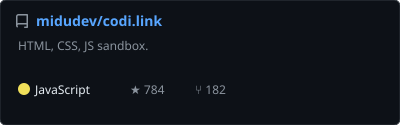
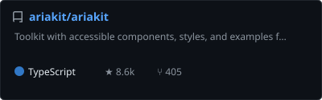
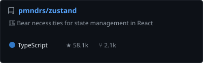
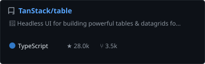

<!--
**davbrito/davbrito** is a ✨ _special_ ✨ repository because its \`README.md\` (this file) appears on your GitHub profile.

Here are some ideas to get you started:

- 🔭 I’m currently working on ...
- 🌱 I’m currently learning ...
- 👯 I’m looking to collaborate on ...
- 🤔 I’m looking for help with ...
- 💬 Ask me about ...
- 📫 How to reach me: ...
- 😄 Pronouns: ...
- ⚡ Fun fact: ...
-->

## Hi there! I'm David, a web developer. 👋

Welcome to my GitHub! I'm a passionate web developer with experience in both frontend and backend development. I love working with JavaScript/TypeScript and have skills in a variety of tools and technologies, including React , TypeScript , Node.js , Deno 🦕, Next.js , Vite  and PostCSS .

### Personal Projects

<dl><dt><a href="https://github.com/davbrito/iteretijs">IteretiJS</a></dt><dd>is a set of JavaScript iterator, generator, and web stream utilities. It's a lightweight library that provides a convenient way to work with streams and iterators in JavaScript, allowing you to write more efficient and maintainable code. It includes utilities such as map, filter, reduce, take, and skip, as well as utilities for working with web streams.</dd><dt><a href="https://github.com/davbrito/minurl">minurl</a></dt><dd>a simple URL shortener built for Cloudflare Pages and using Clodflare Workers KV. It allows you to create short URLs that redirect to long URLs, making it easy to share links on social media or in emails.</dd><dt><a href="https://github.com/davbrito/minisignal">Minisignal</a></dt><dd>A tiny preact signal-like library. It provides a simple way to create and manage state in your React applications, allowing you to easily update your UI based on changes in your application state, while avoiding unnecessary rerenders. It's lightweight and easy to use.</dd><dt><a href="https://github.com/davbrito/dbds">dbds</a></dt><dd>DBDS is a C library of common data structures, including binary trees, vectors, sorted sets, and sorted maps. It provides a fast and efficient way to work with data in C programs, making it a great choice for performance-critical applications. It's also designed to be easy to use and integrate into your existing C codebase.</dd></dl>

I'm proud of these projects and hope you find them useful. If you have any questions or feedback, feel free to reach out to me.

---

### Contact me

If you'd like to collaborate on any of my projects or have any questions about my skills, feel free to get in touch. You can find me on Twitter as [@dv_brito](https://twitter.com/dv_brito). You can also visit my [LinkedIn profile](https://www.linkedin.com/in/dv-brito/) to learn more about my experience and skills.

Thanks for visiting my GitHub!

---

### My fav repos

<table><tr><td>Codi Link</td><td>{fmt}</td><td>lit</td></tr><tr><td>Radix UI Primitives 💖</td><td>Ariakit</td><td>Zustand</td></tr><tr><td>TanStack Table</td></tr></table>

### Top languages on GitHub

> All the stats are generated with
> [github-profile-summary-cards](https://github.com/vn7n24fzkq/github-profile-summary-cards)
